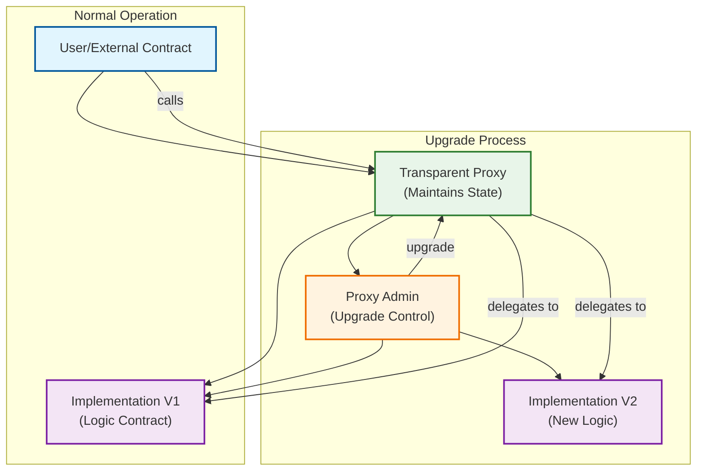

# OEA NFTs Smart Contract

This project implements an upgradeable NFT contract using the OpenZeppelin's transparent proxy pattern. The architecture consists of three main contracts that work together to provide upgradeability while maintaining the same contract address and state.

## Contract Architecture

### 1. Implementation Contract (`OEANFTs.sol`)
- The main contract that contains the NFT logic
- Inherits from OpenZeppelin's upgradeable contracts
- Features:
  - ERC721 NFT standard implementation
  - URI storage for token metadata
  - Owner-controlled minting
  - Authentication mechanism for token ownership
  - Upgradeable design pattern

### 2. Proxy Admin Contract (`OEANFTsProxyAdmin.sol`)
- Manages proxy upgrades
- Controls access to proxy administration
- Only the owner can upgrade the implementation

### 3. Transparent Proxy Contract (`OEANFTsProxy.sol`)
- Delegates all calls to the current implementation
- Maintains the contract state
- Separates admin functions from user functions

## Architecture Diagram



### How It Works

1. **Normal Operation**:
   - Users interact only with the Proxy contract address
   - The Proxy delegates all calls to the current Implementation
   - All state (storage) is kept in the Proxy, not the Implementation

2. **Upgrade Process**:
   - A new Implementation contract is deployed
   - The Proxy Admin executes the upgrade
   - The Proxy now delegates to the new Implementation
   - State is preserved as it lives in the Proxy

3. **Access Control**:
   - Only the Proxy Admin can upgrade the Implementation
   - Admin functions are separated from user functions
   - The Implementation contract is stateless

## Deployment Process

The contracts are deployed in the following order:

1. Implementation contract is deployed
2. Proxy Admin contract is deployed
3. Transparent Proxy is deployed with:
   - Implementation address
   - Proxy Admin address
   - Initialization data

All contract addresses are automatically saved to `contract-addresses.json` for each network.

## Usage

### Initial Deployment
```shell
npx hardhat run ignition/modules/OEANFTs.ts
```

### Upgrading the Contract
1. Make changes to the implementation contract (`OEANFTs.sol`)
2. Run the upgrade script:
```shell
npx hardhat run ignition/modules/upgradeOEANFTs.ts
```

### Development Commands
```shell
npx hardhat help
npx hardhat test
REPORT_GAS=true npx hardhat test
npx hardhat node
```

## Upgradeability Guidelines

When upgrading the contract:
1. Never modify the storage layout of existing variables
2. Only add new storage variables at the end of the contract
3. Don't modify the order or type of existing functions
4. Ensure new implementations are compatible with existing storage

## Contract Addresses

Contract addresses for each network are stored in `contract-addresses.json`. Always use the proxy address when interacting with the contract, as this address will remain constant even after upgrades.

## Security Considerations

1. Only the Proxy Admin owner can upgrade the implementation
2. The implementation contract is initialized immediately after deployment
3. Storage gaps are included to allow for future upgrades
4. All sensitive operations are protected by access control
